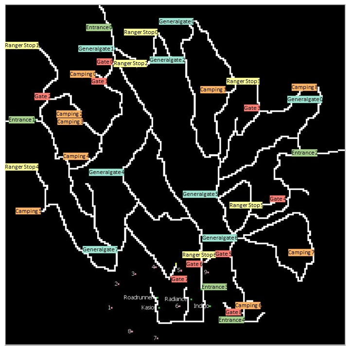
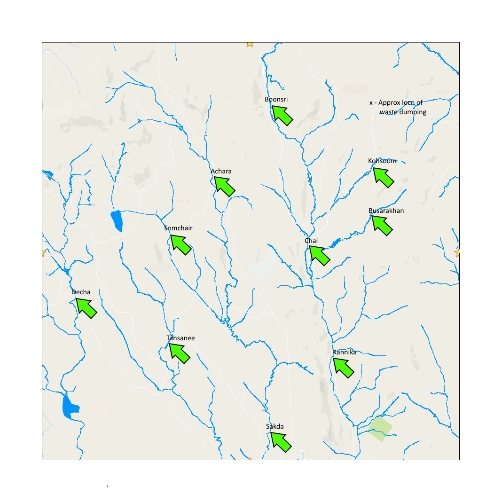

在结合课程知识的基础上，希望大家进一步通过实践来加深对可视化的了解，并尝试使用一些可视化工具完成分析任务。

### 题目一：零售业务分析（30分）

eRetail是一家eBay上的零售店，旗下有多项零售业务，种类繁多，现在它有一份订单数据的清单，想请你帮助分析自己的零售业务。

结合课程知识，将订单数据集导入Power BI或tableau中，用不同的可视化方案，展示该订单的概况。分析多个指标，展示该订单内在的一些特征，或者找到数据之间的关联关系以及发现数据中存在的异常，最后通过一份报告来展示你的结果。

**Bonus**：使用D3编程实现可视化，视情况得到10分以内的bonus。

### 题目二：空气污染源分析（35分）

米斯福德是一座位于乐卡谷野生动物保护区西南方向的一座中等城市。这个城市有一个小工业区，有四个轻工业公司。因为和城市、保护区都靠的很近，工业区的四家工厂的环境指标都高于常规。当地有一位鸟类保护的研究人员Mitch，立即对自然保护区南部的四个制造工厂的烟囱中冒出的气体是否有毒产生怀疑。他认为，这些公司都导致了自然保护区内玫瑰凤头蓝鹨(liù)的锐减。但是当他与公司代表和工作人员交谈时，他们人品似乎都很好，并且环保意识都很强。

实际上，Mitch惊讶地发现，工厂采取了一些步骤使其工艺更加环保。而且，州政府一直在通过一系列传感器监测工厂排放的气体，分布在工厂周围，并设置在烟囱，米斯福德和自然保护区之间。该州已允许Mitch访问其空气采样器数据，气象数据和位置地图。数据涵盖了2016年4月、8月和12月。

Mitch主要工作是确定哪些（如果有的话）工厂可能会导致玫瑰凤头蓝鹨的问题。 通常，空气取样分析处理单个工厂排放的单一化学品。 但是，在这种情况下，有四家工厂，可能每个工厂都排放四种化学品，由九个不同的传感器监测。此外，一些化学物质的排放比其他化学物质更危险。

下面是传感器记录的四种化学物质：

- **Appluimonia** - 该物质的气味可能好闻也可能不好闻。通常，大多数在室外空气中产生气味的物质的浓度不会对人类或动物造成严重伤害，影响长期健康或引发死亡。但是，气味可能会影响生活质量和幸福感。
- **Chlorodinine** - Chlorodinine是一种腐蚀剂，可以攻击和化学破坏暴露的身体组织的材料。腐蚀剂也会损坏甚至破坏金属。它们一接触皮肤，眼睛，呼吸道，消化道或金属就会开始造成伤害。它已被用作消毒剂和消毒剂以及其他用途。吸入或吞咽都是有害的。
- **Methylosmolene** - 这是一系列挥发性有机溶剂的商品名。在发表了几项研究记录了Methylosmolene在脊椎动物中的毒副作用后，该化学品在制造业受到严格监管。法律要求液体形式的Methylosmolene在处理前进行化学中和。
- **AGOC-3A** - 新的环境法规和消费者需求促成了低VOC和零VOC溶剂的开发。大多数制造商现在使用一种或多种低VOC物质，并且米斯福德的工厂非常欣喜并签约使用了这种溶剂。这些新溶剂，包括AGOC-3A，对人类和环境健康的危害较小。

我们提供的数据中，包含了四座工厂的位置以及九个传感器的位置：

- Roadrunner Fitness Electronics: 89,27

- Kasios Office Furniture: 90,21

- Radiance ColourTek: 109,26

- Indigo Sol Boards: 120,22

传感器：

1. 62,21
2. 66,35
3. 76,41
4. 88,45
5. 103,43
6. 102,22
7. 89,3
8. 74,7
9. 119,42 

<u>报告需要回答但不限于以下的问题</u>：

1. 传感器的性能。它们在任何时候都能正常工作吗？你可以通过分析它们捕获的数据来检测传感器的任何异常行为吗？
2. 化学物质。传感器组正在检测哪些化学物质？你所看到的化学物质排放模式如数据中所报告的那样？
3. 哪些工厂排放了哪些化学品？请仔细描述确定该结论的过程。对于确定的工厂，请描述观察到的排放模式。

**Bonus**：使用D3编程实现可视化，视情况得到20分以内的bonus。

### 题目三：水污染分析（35分）

在过去的多次调研中，我们发现有公司在野生动物保护区中倾倒有害物质。但所有公司都否认自己在倾倒有害物质，而且还反诬陷研究人员在栽赃他们。米斯福德大学的教授非常生气，他决定自己亲自前往调研，但是却发现保护区内好多处土壤被运进来的新土壤覆盖了。

还好，米斯福德大学水文研究所的教授推荐，可以通过分析过去几年的水文数据来进而研究土壤污染情况。保护区的水文传感器分布在保护区的不同地点，并且包含了可能感兴趣的化学物质的测量指标。

数据格式如下：

测量数据：

| id   | value | location | sample date | measure           |
| ---- | ----- | -------- | ----------- | ----------------- |
| 2221 | 2     | Boonsri  | 11-Jan-98   | Water temperature |

测量方法的单位：

| measure                | unit |
| ---------------------- | ---- |
| 1,2,3-Trichlorobenzene | ug/l |

<u>报告需要回答但不限于以下的问题</u>：

1. 刻画自然保护区内的水污染的状况（包括过去和现在）
2. 在采样数据中，你发现了什么异常？这些异常的原因可能是？
3. 采集到的数据是否足以了解保护区的综合情况？如果不行，你建议增加怎么样的采样方法，或者如何改进采样方法？

**Bonus**：使用D3编程实现可视化，视情况得到20分以内的bonus。

### 可用工具

- [Tableau](https://www.tableau.com/)(推荐)
- [Power BI](https://powerbi.microsoft.com/zh-cn/)
- [d3.js](https://d3js.org/)

### 评分规则

1. **可视化**：配色美观，方案合理。(25%)
2. **分析能力**：选取的可视化方案足够丰富，能够有效展示整个数据集；并且可视化方案合理，能够有效的对数据集展开分析。(35%)
3. **故事性**：报告需要能够阐述 1)可视化方案的选取理由 2)分析结果 3)从可视化方案到分析结果的推理过程 4)从分析结果衍生的意见建议等发散性思考，如假如需要设计其他可视化方案，要怎么进行编码（该部分不是必须）(40%)
4. **关于bonus**：用d3.js进行编程实现可视化方案来展示整个数据集，将视情况获得10分以内的加分。在上面的评分规则的基础上，视编程容易程度以及创新性作为加分的依据。

- 最终，每个小组会得到一个平均分，组长需要协调组内成员，根据组员的表现，分配给组员相应的分数，但最终分数的平均值需要等于给定的平均分。

### 关于答辩

- 时间：7号上午8:00-12:00，下午2:00-5:00
- 地点：东二101
- 流程：每个小组拥有10分钟的展示时间，5分钟的答辩时间。顺序按照小组序号。